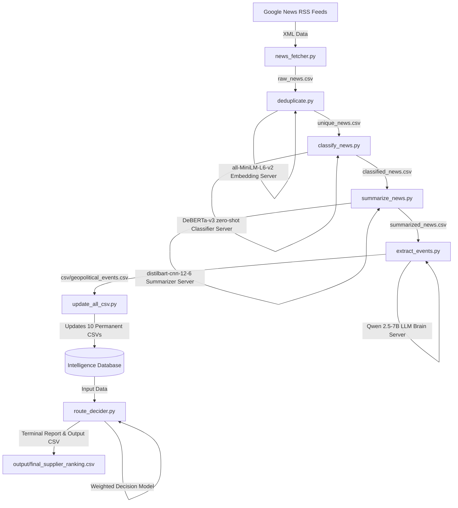

# System Documentation: AI-Driven Energy Supply Chain Resilience for Import-Dependent Economies

## 1. Executive Summary & Problem Context
India imports approximately **88% of its crude oil**, with **40–45%** of that volume transiting through the **Strait of Hormuz**. This creates a massive structural vulnerability that is repeatedly exposed by geopolitical crises, such as the 2025 US-Iran standoff (which spiked Brent crude by over 8% in a single session) and shipping lane blockades in the Red Sea and Bab el-Mandeb by Houthi forces. 

With India's **Strategic Petroleum Reserves (SPR)** providing only **9.5 days** of national consumption cover, any sustained disruption threatens immediate industrial and economic instability. McKinsey analyses indicate that economies lacking automated rerouting and demand-management intelligence take an average of **47 days longer** to stabilize supply chains during disruptions than those with integrated decision intelligence.

This project implements an **AI-Driven Energy Supply Chain Resilience system** that:
1. Ingests live news feeds, shipping risk signals, and commodity prices in real time.
2. Models disruption scenarios and their cascading effects on geopolitical, port, and chokepoint risk factors.
3. Operates a **multi-criteria Procurement Decision Engine** to recommend optimal oil suppliers, routing alternatives, shipping costs, and insurance risk adjustments.
4. Uses a **hierarchical model architecture** that runs on free T4 GPUs (e.g., Google Colab) to process feeds and make decisions within **1 hour**, eliminating the need for expensive commercial LLM APIs.

---

## 2. High-Level System Architecture

The following diagram illustrates how the system retrieves, filters, processes, structures, and converts raw feed signals into a ranked supplier recommendations database:



---

## 3. Model Hierarchy & Colab Server-Side Architecture

To achieve high-throughput processing while maintaining zero API costs, the system splits work across **4 distinct models** hosted on T4 GPUs (such as Google Colab free tier). They are exposed via **FastAPI** web servers and bridged to the local pipeline using **Cloudflare Tunnels** (`trycloudflare.com`).

| Model Name / Role | Model HuggingFace Repository | Parameter Class | Purpose & Optimization |
| :--- | :--- | :--- | :--- |
| **Embedding Server** | `sentence-transformers/all-MiniLM-L6-v2` | 22M Parameters | Converts news titles and descriptions into 384-dimensional dense vectors. Used locally to calculate cosine similarity and prune duplicate feeds. |
| **Classifier Server** | `MoritzLaurer/DeBERTa-v3-base-mnli-fever-anli` | 86M Parameters | Runs zero-shot text classification against 15 geopolitical/logistical categories. Filters out noise and unrelated articles. |
| **Summarizer Server** | `sshleifer/distilbart-cnn-12-6` | 306M Parameters | Compresses long, noisy news texts into 1-2 sentence summaries, saving tokens and context window space for the final LLM stage. |
| **LLM Brain Server** | `Qwen/Qwen2.5-7B-Instruct` | 7 Billion Parameters | Parses short summaries to extract 12 structured JSON parameters (location, severity, affected chokepoints, ports, etc.). |

### Server-Side Code Pattern (Google Colab Notebooks)
Each notebook in the `External_Server_run_on_colab/` directory exposes a port (usually `8000`) and registers a FastAPI app:
```python
from fastapi import FastAPI
from pydantic import BaseModel
import uvicorn

app = FastAPI()

class ChatRequest(BaseModel):
    message: str # Or text, candidate_labels depending on server type

@app.post("/chat")
def process(request: ChatRequest):
    # Perform inference and return JSON
    return {"response": result}
```
A subprocess runs Cloudflare's tunnel binary:
```bash
!cloudflared tunnel --url http://127.0.0.1:8000
```
This prints a public ingress URL (e.g. `https://*.trycloudflare.com`) which the user copies and places in the local `Model/` wrappers before starting a run.

---

## 4. Intelligence Database: CSV File Dictionary

The system maintains a relational database in the form of flat CSV files divided into **10 Permanent CSVs** (stateful knowledge graphs and reference data) and **4 Temporary CSVs** (handling pipeline execution data).

### 4.1. Permanent CSV Files (located in `csv/`)

1. **`csv/geopolitical_events.csv`**:
   - **Significance**: Persistently records every extracted event from live feeds. It acts as the audit log of geopolitical disruptions.
   - **Key Fields**: `country`, `actor`, `event_type`, `severity` (0-5), `political_risk`, `export_risk`, `affected_chokepoints`, `sanction`, `reason`, `title`, `published`, `link`, `summary`.
2. **`csv/supplier_preference.csv`**:
   - **Significance**: The central risk-tracking table. It stores baseline and dynamically adjusted risks for every oil exporter.
   - **Key Fields**: `Country`, `Preference Score`, `Political Risk`, `Sanction Risk`, `Conflict Risk`, `Export Stability`, `Port Risk`, `Chokepoint Risk`, `Confidence`.
3. **`csv/sanctions.csv`**:
   - **Significance**: Tracks active trade sanctions imposed on oil exporting nations.
   - **Key Fields**: `Country`, `Sanctioned` (Yes/No), `By Whom`, `Severity` (Low/Medium/High), `Active` (Yes/No).
4. **`csv/port_security.csv`**:
   - **Significance**: Monitors terminal-level security risks and operational blockades at export ports.
   - **Key Fields**: `Port`, `Country`, `Risk` (Low/Medium/High), `Military Threat` (Low/Medium/High), `Blocked` (Yes/No/Partial), `Sanctions`.
5. **`csv/conflict_status.csv`**:
   - **Significance**: Maps active war zones, civil conflicts, internal security issues, and terror risk indicators.
   - **Key Fields**: `Country`, `War` (Yes/No), `Civil War` (Yes/No), `Internal Stability` (Low/Medium/High), `Terror Risk` (Low/Medium/High/Very High).
6. **`csv/diplomatic_risk.csv`**:
   - **Significance**: Tracks core political, export, and governmental stability ratings.
   - **Key Fields**: `Country`, `Political Stability`, `Export Stability`, `Government Stability`.
7. **`csv/chokepoint_dependency.csv`**:
   - **Significance**: Maps which maritime chokepoints each exporter must transit to reach India (e.g. Hormuz, Red Sea, Suez Canal, Bab-el-Mandeb, Cape of Good Hope).
   - **Key Fields**: `Country`, `Hormuz` (Yes/No/Partial), `Red Sea`, `Suez`, `Bab-el-Mandeb`, `Cape Route`.
8. **`csv/geopolitical_relation.csv`**:
   - **Significance**: Quantitative indexing of bilateral diplomatic ties between exporting nations and India, as well as major superpowers (USA, China, Russia, Iran).
   - **Key Fields**: `Country`, `Relation with India` (0-100), `Relation with USA`, `Relation with Iran`, `Relation Score`.
9. **`csv/exporters.csv`**:
   - **Significance**: Baseline logistical profiling of exporters (crude qualities, capacities, and membership status).
   - **Key Fields**: `Country`, `Export Capacity` (in bpd), `Production`, `OPEC` (Yes/No), `OPEC+`, `Crude Grade` (e.g., Heavy Sour, Light Sweet), `Current Export to India`, `Strategic Notes`.
10. **`csv/supplier_dependency.csv`**:
    - **Significance**: Monitors India's reliance on each supplier and details spare supply margins.
    - **Key Fields**: `Country`, `India Import %`, `Can Increase Export?` (Yes/No), `Spare Capacity`.

### 4.2. Temporary CSV Files (located in workspace root)

1. **`raw_news.csv`**:
   - Ingests feeds matching keywords like `oil`, `tanker`, `sanction`, and `Hormuz` from Google News RSS.
2. **`unique_news.csv`**:
   - Stores articles after running embedding-based deduplication (similarity threshold: 90%).
3. **`classified_news.csv`**:
   - Contains classified articles mapped to event types, filtering out records below 0.45 confidence.
4. **`summarized_news.csv`**:
   - Contains shortened 1-2 sentence summaries generated by the DistilBART server.

---

## 5. Detailed Pipeline Modules & Code Walkthrough

### 5.1. News Fetching & Keyword Filtering
File: `news_fetcher.py`  
Queries Google News RSS feeds for search terms: `Strait of Hormuz`, `Iran Oil`, `Red Sea Shipping`, `OPEC`, `Saudi Oil`, `Russia Oil`, `Global Energy Security`, and `Iran Sanctions`. It extracts the titles and descriptions, cleans HTML tags via `BeautifulSoup`, filters articles to ensure at least one keyword (e.g. `tanker`, `sanctions`, `suez`) is present, and saves them to `raw_news.csv`.

### 5.2. Similarity-Based Deduplication
File: `deduplicate.py`  
Sends article text to the lightweight `sentence-transformers/all-MiniLM-L6-v2` server. It calculates pairwise cosine similarity scores. If the score is $\ge 0.90$, it flags them as duplicates, keeps the article with the longer text (which contains more details), and saves the results to `unique_news.csv`.

### 5.3. Parallel Classification & Confidence Pruning
File: `classify_news.py`  
Fires concurrent requests (`ThreadPoolExecutor` with 10 workers) to the `DeBERTa-v3` zero-shot classifier. It maps articles to categories (e.g., `Military Attack`, `Shipping Attack`, `Sanctions`, `Port Closure`, `Oil Production Cut`). If the classifier's top label confidence is $< 0.45$, the article is dropped as noise. Outputs `classified_news.csv`.

### 5.4. High-Efficiency Summarization
File: `summarize_news.py`  
Uses `ThreadPoolExecutor` (6 workers) to prompt the `sshleifer/distilbart-cnn-12-6` server. This generates compact, factual summaries. Saves outputs to `summarized_news.csv`.

### 5.5. LLM Feature Extraction
File: `extract_events.py`  
Feeds the short summaries to `Qwen 2.5-7B`. The prompt instructs the LLM to output a strict JSON structure containing variables such as: country, severity (0-5), affected exporters, ports, and chokepoints. It parses the JSON block using regular expressions and stores it in `csv/geopolitical_events.csv`.

### 5.6. Geopolitical Database Updater
File: `update_all_csv.py`  
Loads the permanent CSV database tables. It processes each event inside `geopolitical_events.csv` to dynamically adjust variables:
*   **Conflict Status**: Sets `War` or `Civil War` to "Yes" and increases `Terror Risk` or decreases `Internal Stability` based on keywords and event severity.
*   **Sanctions**: If sanctions are detected, it updates active status and scales severity.
*   **Ports & Chokepoints**: Flags specific ports as `Blocked` or under threat. Marks chokepoints (`Hormuz`, `Red Sea`, `Suez`) as compromised.
*   **Supplier Risk**: Adjusts numerical risks (`Political Risk`, `Sanction Risk`, `Conflict Risk`, `Port Risk`, `Chokepoint Risk`).
*   **Bilateral Alignment Bonus**: Incorporates relationship scores with India, spare capacity, and export capacities. It subtracts chokepoint penalties (e.g., -35 points for Hormuz transit, -20 points for Red Sea transit) and adds bonuses (+10 points) for suppliers completely outside Middle Eastern chokepoints (e.g. Nigeria, Brazil).
*   **Bypassing Rules**: UAE receives a $+8$ preference score adjustment since its Fujairah port bypasses the Strait of Hormuz. Conversely, Iraq receives a $-15$ penalty due to its total dependency on the Strait of Hormuz and frequent spot cargo cancellations.

---

## 6. The Procurement Decision Engine & Multicriteria Scoring Model

The core of the system is the **Procurement Decision Engine** in `route_decider.py`. It operates 4 sub-engines:

### 6.1. Oil Price Engine
Fetches the live Brent crude price via the Alpha Vantage API (with a default fallback of $\$78.40$ if API limits are reached). It applies exporter price differentials (e.g. Urals crude at $-\$3.00$, UAE Murban at $+\$0.20$, WTI Midland at $+\$1.50$) to calculate the country's Base Oil Price. It then calculates a `Price Score` by normalizing these prices (lower price = higher score).

### 6.2. Shipping Route Engine
Retrieves maritime routes and ports. It calculates base shipping costs ($/barrel) and assigns a `Route Safety` score:
$$\text{Route Safety} = 100 - (12 \times \text{Hormuz}) - (10 \times \text{Red Sea}) - (8 \times \text{Bab-el-Mandeb}) - (6 \times \text{Suez}) + (3 \times \text{Cape Route})$$
*(where chokepoint variables evaluate to 1.0 for Yes, 0.5 for Partial, and 0.0 for No based on level maps)*.

### 6.3. Insurance Engine
Models the risk-adjusted insurance premium additions to the delivered price.
$$\text{Insurance Premium} = \text{Base Insurance } (\$0.80) + \text{Conflict Cost} + \text{Sanctions Penalty} + \text{Port Threat} + \text{Chokepoint Threat}$$
Where:
*   **Conflict Cost**: Active War adds $+\$0.60$, Civil War adds $+\$0.50$, Terror Risk (Very High/High/Medium/Low) adds up to $+\$0.40$.
*   **Sanctions Penalty**: Active sanctions add $+\$0.40$.
*   **Port Threat**: A blocked port adds $+\$0.40$, partial blockade adds $+\$0.20$.
*   **Chokepoint Threat**: Hormuz transit adds $+\$0.30$, Red Sea adds $+\$0.25$, Bab-el-Mandeb adds $+\$0.25$, Suez adds $+\$0.20$.

The sub-engine computes the total delivered price:
$$\text{Delivered Price} = \text{Base Oil Price} + \text{Shipping Cost} + \text{Insurance Premium}$$
This is normalized inversely to output the `Delivered Price Score`.

### 6.4. Decision Engine (Scoring Weights)
The final supplier score is a weighted multi-criteria aggregation. The weights reflect India's strategic priorities (minimizing chokepoint transit risks while prioritizing long-term alliance stability and delivered cost):

| Criteria | Weight | Description |
| :--- | :--- | :--- |
| **Preference** | 40% | Dynamic geopolitical alignment, spare capacity, and chokepoint safety margins from `supplier_preference.csv` |
| **Price** | 20% | Inversely normalized delivered price (Base Price + Shipping + Insurance) |
| **Route Safety** | 15% | Safety rating of the maritime lanes (Hormuz/Red Sea bypass capability) |
| **Insurance** | 10% | Inverse score of risk-adjusted premiums |
| **Shipping** | 5% | Inverse score of standard shipping transit rates |
| **Political** | 4% | Country-level political stability from `diplomatic_risk.csv` |
| **Export** | 3% | Exporter output consistency rating |
| **Government** | 3% | Sovereign governance stability |

#### Event Penalty Deduction
To make the system highly responsive to sudden crises, the engine applies an absolute deduction based on the severity of the country's most recent event within the news cycle:
*   Severity $\ge 5$: **-20 points**
*   Severity $= 4$: **-15 points**
*   Severity $= 3$: **-8 points**
*   Severity $= 2$: **-4 points**

$$\text{Final Score} = \sum (\text{Metric Score} \times \text{Weight}) - \text{Event Penalty}$$

Exporters are sorted by `Final Score` in descending order to output a ranked list. The top supplier is selected as the recommended alternative procurement route.

---

## 7. How to Deploy & Run the Project

1.  **Upload and Run Notebooks on Google Colab (T4 Runtime)**:
    *   Upload all notebooks located in the `External_Server_run_on_colab/` directory to Google Colab.
    *   Ensure the Colab runtime type is configured to run on a **T4 GPU** runtime.
    *   Execute all cells in each notebook. This starts a FastAPI server and sets up a Cloudflare tunnel.
    *   Copy the public Cloudflare tunnel ingress URL generated in the output (e.g., `https://*.trycloudflare.com`).

2.  **Configure API Clients on the Local Machine**:
    *   Open the corresponding Python wrapper files in the `Model/` directory on your local machine.
    *   Paste the respective Cloudflare URL into the `API_URL` variable, ensuring that you append **`/chat`** to the end of the URL.
    *   Use the following mapping to pair each notebook's link with the correct local wrapper:
        *   **`classifier.ipynb`** (Cloudflare link) $\rightarrow$ Paste in `Model/classifier.py` as `API_URL` (appending `/chat`, e.g., `https://<tunnel-id>.trycloudflare.com/chat`).
        *   **`embedding.ipynb`** (Cloudflare link) $\rightarrow$ Paste in `Model/embedding.py` as `API_URL` (appending `/chat`, e.g., `https://<tunnel-id>.trycloudflare.com/chat`).
        *   **`sumarize.ipynb`** (Cloudflare link) $\rightarrow$ Paste in `Model/summarizer.py` as `API_URL` (appending `/chat`, e.g., `https://<tunnel-id>.trycloudflare.com/chat`).
        *   **`LLM.ipynb`** (Cloudflare link) $\rightarrow$ Paste in `Model/qwen.py` as `API_URL` (appending `/chat`, e.g., `https://<tunnel-id>.trycloudflare.com/chat`).

3.  **Run the Pipeline**:
    *   Execute the main script:
        ```powershell
        python main.py
        ```
    *   The terminal will print step-by-step progress, detailed sub-engine metrics, and the final supplier rankings.
    *   The structured ranking results are saved to `output/final_supplier_ranking.csv`.
